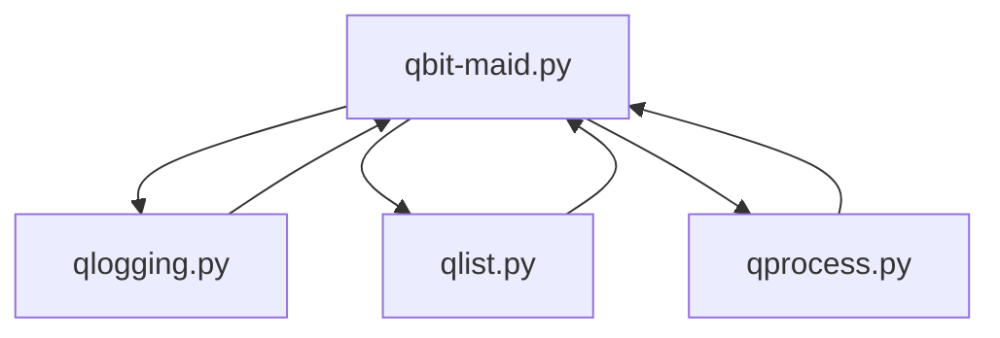

# qbit-maid

Warning: This application removes torrents that aren't downloading and that aren't from iptorrents. Age in the config.json only controls the age for torrents from iptorrents.

The objective is to filter torrents based on the following criteria:
- tracker domain name
- age
- ratio
- state



| File | Purpose |
| --- | --- |
| qbit-maid.py | Client to the qbit api and calls functions from the other files |
| qlist.py | Builds out torrent lists |
| qlogging.py | Logging and push notification communication |
| qprocess.py | Submits qualifying torrents for deletion |

You will need a config.json in the root directory.

It should look something like this:
Config.json
```
{
    "host": "192.168.1.1",
    "port": 8080,
    "username": "admin",
    "password": "admin",
    "loglevel": "INFO",
    "logpath": "./qc.log",
    "age": 2419200,
    "use_pushover": true,
    "use_log": true,
    "po_key": "",
    "po_token": ""
}
```
| Key | Value |
| --- | --- |
| host | string, ip or hostname of qbittorrent server |
| port | number, port of admin gui(used for api aswell) |
| username | admin account for qbittorrent |
| password | password for admin account |
| loglevel | is what log messages are written to the log file. INFO or DEBUG are valid entries(case sensitive) |
| logpath | will write a log in root directory if left as is other wise specify other path using forward slashes |
| age | number, seconds for how long we keep torrents from IPTORRENTS |
| use_pushover | true or false to enable or disable pushover notification summary |
| use_log | true or false to enable or disable writing to alog file |
| po_key | pushover key |
| po_token | pushover api token |