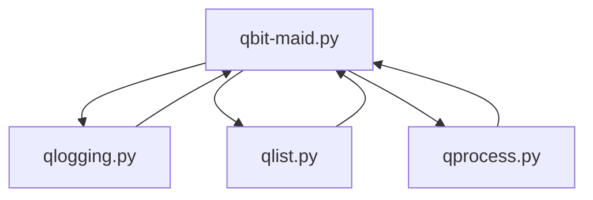

# qbit-maid

## Warning: This application removes torrents that are over the minimum age and that are not part of the ignored categories, domains or tags. Please use the delete_torrents feature set to false when first testing its functionality.

The objective is to remove torrents based on the following criteria:
- tracker domain name
- age
- ratio
- state



| File | Purpose |
| --- | --- |
| qbit-maid.py | Client to the qbit api and calls functions from the other files |
| qlist.py | Builds out torrent lists |
| qlogging.py | Logging and push notification communication |
| qprocess.py | Submits qualifying torrents for deletion |
| test_qbitmaid.py | Unit tests |
| ignored_categories.json | whitelist for categorys to ignore |
| ignored_tags.json | whitelist for torrent tags to ignore |
| ignored_trackers.json | whitelist of fqdn names to ignore |

You will need a config.json in the root directory.

| Key | Value |
| --- | --- |
| host | string, ip or hostname of qbittorrent server |
| port | number, port of admin gui(used for api aswell) |
| username | admin account for qbittorrent |
| password | password for admin account |
| log_level | is what log messages are written to the log file. INFO or DEBUG are valid entries(case sensitive) |
| protected_tag | used to mark torrents to handle with care |
| non_protected_tag | we don't care about these torrents |
| log_path | will write a log in root directory if left as is other wise specify other path using forward slashes |
| age | number, seconds for how long we keep torrents from IPTORRENTS |
| minimum_age | age in seconds torrents should reached before they are removed |
| use_pushover | true or false to enable or disable pushover notification summary |
| use_log | true or false to enable or disable writing to alog file |
| po_key | pushover key |
| po_token | pushover api token |
| delete_torrents | true or false to enable or disable deletion. Useful for dry-runs |
| enable_dragnet | true or false to enable dragnet functionality. Useful for debugging |

It should look something like this:
Config.json
```
{
    "host": "192.168.1.1",
    "port": 8080,
    "username": "admin",
    "password": "admin",
    "loglevel": "INFO",
    "logpath": "./qc.log",
    "protected_tag": "ipt",
    "non_protected_tag": "public",
    "age": 2419200,
    "minimum_age": 432000,
    "use_pushover": false,
    "use_log": true,
    "po_key": "",
    "po_token": "",
    "delete_torrents": false
    "enable_dragnet": false,
    "dragnet_outfile": "./orphaned.csv"
}
```

You will need a ignored_categories.json in the root directory. This will ignore any of the categories found in the values of the entries.
```
{
    "example": "general",
    "example2": "sonarr"
}
```

You will need a ignored_domains.json in the root directory. This will ignore any torrents from these trackers.
```
{
"iptorrents-empirehost": "ssl.empirehost.me",
"iptorrents-stackoverflow": "localhost.stackoverflow.tech",
"iptorrents-bgp": "routing.bgp.technology"
}
```

You will need a ignored_tags.json in the root directory. This will ignore any torrents with these tags.
```
{
"first":"first",
"second":"second",
"third":"third"
}
```